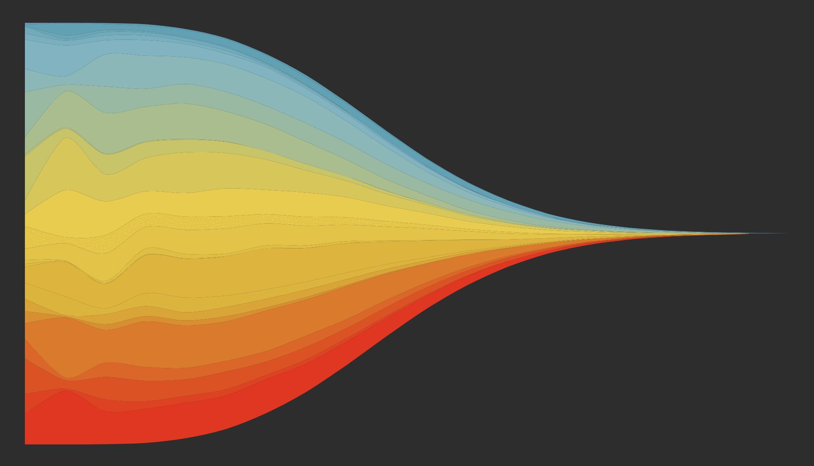

# letters_stream

Crete an interactive streamgraph (html widget) to look at the distribution of letters throughout the length of words in English using the streamgraph R package (https://hrbrmstr.github.io/streamgraph/) to create a D3.js based html widget.

The widget can be viewed here:
https://annebozack.github.io/letters_stream/streamgraphDropdown.html

